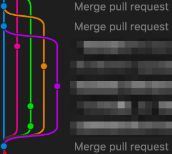

# 🔀Git 規範

## 📋目錄

- [Git樹](#🌳Git樹)
- [操作](#操作)
- [Emoji](#Emoji)
- [習慣](#習慣)

### 🌳Git樹

Git tree / graph 能讓你很方便的察看時間流的各種 commit 和 branch
可以使用 vscode 的 extension 或是額外的軟體來輔助開發
目前推薦使用的是 source tree 和 vscode extension 內的 git graph

### 操作

Git 有很多種操作，比較常見且需要的有以下幾種

- commit : 提交修改，訊息應該要精簡並且有足夠的資訊，最好能附上 Emoji
- push : 推送 branch 到倉庫
- merge : 合併分支, A merge into B, 代表 B 繼承 A 的修改內容
- fetch : 檢查遠端倉庫有沒有任何 git 更改
- pull : 將遠端分支抓下來或是更新 local 分支到遠端分支的版本
- check : 切換當前分支
- branch : 建立新分支
- revert : 回朔當前分支到某個 commit 並且創建新的 commit, 一般不會使用到

### Emoji

在 commit 中加入 Emoji 能大幅提高 git 的可讀性和維護性，因此建議每個 commit 都加入 Emoji
目前比較常用的 Emoji 有以下幾種，或是參考一些 [Emoji git](https://gitmoji.dev/) 網站

* `✨:sparkles:` - 新功能
* `🐛:bug:` - 修復 bug
* `📝:memo:` - 撰寫文檔
* `🎨:art:` - 改進代碼結構/格式
* `⚡️:zap:` - 改進效能
* `🔥:fire:` - 刪除代碼或文件
* `🚀:rocket:` - 部署功能
* `🚧:construction:` - 正在進行中

範例 : `:memo: Add project README`

### 習慣

與團隊的協作過程是需要大家一起維護的，因此 project 內的操作流程需要以團隊規範為主
最主要的就是養成好習慣 :

- 時常使用 fetch 來檢查 git 更新
- 使用到的 branch 如果版本不一樣需要時常 pull
- 一般來說不會直接修改主分支如 `master` `main` 而是使用 merge 或 pull request 來合併到主分支
- 建立新主題時創建新的 branch 來開發
- commit 內容不要太複雜，盡量主題單一，可以做多個 commit 來修改不同 part 也不要全部擠在一起
- 認清團隊中的定位，不熟悉請不要做危險的操作，避免 git 災難性的毀滅，如 `merge` `revert` 等
- 多與團隊成員討論，了解目前其他成員的工作內容
- 求救並不可恥，比後悔有用
